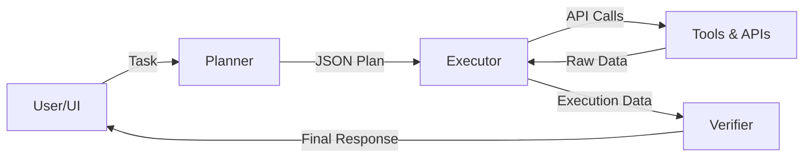

# AI Operations Assistant

A multi-agent AI system that plans tasks, executes real APIs, and verifies outputs.

## Features
- **Multi-Agent Architecture**: Planner (Decomposition), Executor (Tool Use), Verifier (Validation).
- **Real APIs**: Integration with Open-Meteo (Weather), OpenStreetMap (Geocoding), Wikipedia, Yahoo Finance, and NewsAPI.
- **Privacy First**: Uses free, public APIs where possible (no keys for Weather/Maps).
- **Demo UI**: Optional Streamlit frontend for easy testing.

## Architecture



## Quick Start

1. **Install Dependencies**
   ```bash
   pip install -r requirements.txt
   ```

2. **Setup Environment**
   ```bash
   cp .env.example .env
   # Add OPENAI_API_KEY into .env
   ```

3. **Run Backend (Core)**
   ```bash
   python main.py
   ```
   *API will run on http://0.0.0.0:8000*

4. **Run Frontend (Optional)**
   ```bash
   streamlit run streamlit_app.py
   ```

## Example Tasks

| Category | Prompt | Expected Outcome |
| :--- | :--- | :--- |
| **Weather** | "What is the weather in Tokyo?" | generic -> geocoding -> wether API -> Table with temperature/wind. |
| **Finance** | "Stock price of Apple vs Microsoft" | yahoo_finance for both tickers -> Comparison table. |
| **Complex** | "Weather in London and CEO of Tesla" | Parallel execution of weather check and Wikipedia search. |

## Weather Integration
Weather data is fetched using the Open-Meteo REST API. City names are first converted to geographic coordinates using the OpenStreetMap Nominatim API. Both services are free, require no authentication, and communicate via standard HTTP APIs.
